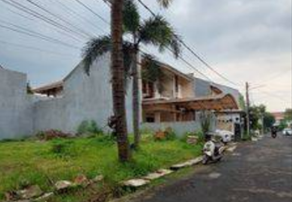

<head>
  <meta charset="utf-8" />
  <meta name="viewport" content="width=device-width, initial-scale=1" />
  <title>KJPP Hari Utomo dan Rekan</title>
  <link rel="stylesheet" href="https://diy.magis.unwahas.ac.id/AdminLTE/plugins/fontawesome-free/css/all.min.css" />
  <link href="https://diy.magis.unwahas.ac.id/css/app.css" rel="stylesheet" />
  <link rel="stylesheet" href="https://unpkg.com/leaflet@1.7.1/dist/leaflet.css" integrity="sha512-xodZBNTC5n17Xt2atTPuE1HxjVMSvLVW9ocqUKLsCC5CXdbqCmblAshOMAS6/keqq/sMZMZ19scR4PsZChSR7A==" crossorigin="" />
  
  
  <!-- jQuery -->
  
  <!-- Bootstrap 4 -->
  
  <!-- DataTables -->
  
  
  
  
</head>

   

    <a href="https://hariutomo.co.id/" class="btn" style="background-color: #84C2D8; border-radius: 10px">Kembali</a>
   

  

    

      

        <h3 class="card-title">
          Peta
        </h3>
        

        

      

    

  

  

    

      <!-- /.card-header -->
      

        <h3 class="card-title">
      Gambar
        </h3>
        

        

          <ol class="carousel-indicators">
           <li data-target="#carouselExampleIndicators" data-slide-to="0" class="active"></li>
          </ol>
          

                        

				
            

                      

          <a class="carousel-control-prev" href="Sarah2.png" role="button" data-slide="prev">
            
              <i class="fas fa-chevron-left"></i>
            
            Previous
          </a>
          <a class="carousel-control-next" href="Sarah3.png" role="button" data-slide="next">
            
              <i class="fas fa-chevron-right"></i>
            
            Next
          </a>
        

      

     
    

  

  

    

      

        <h3 class="card-title">Detail Objek</h3>
      

    <!-- /.card-header -->
      

        <table class="table table-bordered">
          <tbody>
			 <tr>
              <td> Lokasi  </td>
              <td>:</td>
              <td>Jalan Lingkungan RT.001 RW.03 Kav.1, Kelurahan Batu Ampar, Kecamatan Kramat Jati, Kota Jakarta Timur, Provinsi DKI Jakarta.</td>
            </tr>
			 <tr>
              <td>Basis Nilai</td>
              <td>: </td>
              <td>Nilai Pasar dan Indikasi Nilai Likuidasi</td>
            </tr>
			<tr>
              <td>Tanggal Inspeksi</td>
              <td>: </td>
              <td>23 Februari 2023</td>
            </tr>
			<tr>
              <td>Tanggal Penilaian</td>
              <td>: </td>
              <td>22 Februari 2023</td>
            </tr>
			<tr>
              <td>Tahun Penilaian</td>
              <td>: </td>
              <td> 2023 </td>
            </tr>
			<tr>
              <td>Titik Koordinat</td>
              <td>:</td>
              <td><a href="https://www.google.com/maps/place/6%C2%B017'30.6%22S+106%C2%B051'22.9%22E/@-6.258688,106.7712512,13z/data=!4m4!3m3!8m2!3d-6.291835!4d106.856373?entry=ttu">
  -6.291835, 106.856373										
                  </a></td>
            </tr>
			<tr>
              <th>Jenis Data</th>
              <th style="width: 10px">:</th>
              <th>Rumah Tinggal</th>
            </tr>
           <tr>
              <td>Luas Tanah Sertipikat</td>
              <td>:</td>
              <td> 382 m2</td>
            </tr>
			<tr>
              <td>Luas Bangunan</td>
              <td>:</td>
              <td> 308 m2</td>
            </tr>
			<tr>
              <td>Nilai Pnwrn/Transaksi</td>
              <td>:</td>
              <td>Rp. 5.673.620.000,-</td>
            </tr>
			<tr>
              <td>Indikasi Nilai Pasar Tanah/m2</td>
              <td>:</td>
              <td>Rp 10.950.000.-</td>
            </tr>
          </tbody>
        </table>
      

    

    <!-- /.card -->

    

      

        <h3 class="card-title">DATA Pembanding 1</h3>
      

	   

        <table class="table table-bordered">

          <tbody>
<tr>
              <td> Lokasi  </td>
              <td>:</td>
              <td>Jalan Alam Indah Condet</td>
            </tr>
			<tr>
              <td>Titik Koordinat</td>
              <td>:</td>
              <td><a href="">
-		
                  </a></td>
            </tr>
			<tr>
              <th>Jenis Data</th>
              <th style="width: 10px">:</th>
              <th>Tanah Kosong</th>
            </tr>
           <tr>
              <td>Nama Sumber Data</td>
              <td>:</td>
              <td>Agen Properti</td>
            </tr>
			<tr>
              <td>No. Telp. Sumber Data </td>
              <td>: </td>
              <td>0813 1148 0354</td>
            </tr>
			<tr>
              <td>Luas Tanah Sertipikat</td>
              <td>:</td>
              <td>174 m2</td>
            </tr>
			<tr>
              <td>Luas Bangunan</td>
              <td>:</td>
              <td> m2</td>
            </tr>
			<tr>
              <td>Nilai Pnwrn/Transaksi</td>
              <td>:</td>
              <td>Rp. 2.349.000.000,-</td>
            </tr>
			<tr>
              <td>Indikasi Nilai Pasar Tanah/m2</td>
              <td>:</td>
              <td>Rp. 11.480.000,-</td>
            </tr>
          </tbody>
        </table>
      

    

  

  

    

      

        <h3 class="card-title">DATA Pembanding 2</h3>
      

      <!-- /.card-header -->
      

        <table class="table table-bordered">
          <tbody>
			<tr>
              <td> Lokasi  </td>
              <td>:</td>
              <td>Jalan Alam Indah Condet</td>
            </tr>
			<tr>
              <td>Titik Koordinat</td>
              <td>:</td>
              <td><a href="">
-
                  </a></td>
            </tr>
			<tr>
              <th>Jenis Data</th>
              <th style="width: 10px">:</th>
              <th>Rumah tinggal</th>
            </tr>
			<tr>
              <td>Nama Sumber Data</td>
              <td>:</td>
              <td>Agen Properti</td>
            </tr>
			<tr>
              <td>No. Telp. Sumber Data </td>
              <td>: </td>
              <td>0811 1980 596</td>
            </tr>
			<tr>
              <td>Luas Tanah Sertipikat</td>
              <td>:</td>
              <td>140 m2</td>
            </tr>
			<tr>
              <td>Luas Bangunan</td>
              <td>:</td>
              <td>203 m2</td>
            </tr>
			<tr>
              <td>Nilai Pnwrn/Transaksi</td>
              <td>:</td>
              <td>Rp. 3.000.000.000,-</td>
            </tr>
			<tr>
              <td>Indikasi Nilai Pasar Tanah/m2</td>
              <td>:</td>
              <td>Rp. 11.440.000,-</td>
            </tr>
          </tbody>
        </table>
      

    

    <!-- /.card -->
    

      

        <h3 class="card-title">DATA Pembanding 3</h3>
      

      <!-- /.card-header -->
      

        <table class="table table-bordered">
         <tbody>
			<tr>
              <td> Lokasi  </td>
              <td>:</td>
              <td>Jalan Raya Condet</td>
            </tr>
			<tr>
              <td>Titik Koordinat</td>
              <td>:</td>
              <td><a href="">
-
                  </a></td>
            </tr>
			<tr>
              <th>Jenis Data</th>
              <th style="width: 10px">:</th>
              <th>Rumah tinggal</th>
            </tr>
           <tr>
              <td>Nama Sumber Data</td>
              <td>:</td>
              <td> Agen properti </td>
            </tr>
			<tr>
              <td>No. Telp. Sumber Data </td>
              <td>: </td>
              <td>0812 8822 5274</td>
            </tr>
			<tr>
              <td>Luas Tanah Sertipikat</td>
              <td>:</td>
              <td> 472 m2</td>
            </tr>
			<tr>
              <td>Luas Bangunan</td>
              <td>:</td>
              <td> 300 m2</td>
            </tr>
			<tr>
              <td>Nilai Pnwrn/Transaksi</td>
              <td>:</td>
              <td>Rp. 9.900.000.000,-</td>
            </tr>
			<tr>
              <td>Indikasi Nilai Pasar Tanah/m2</td>
              <td>:</td>
              <td>Rp. 16.620.000,-</td>
            </tr>
          </tbody>
        </table>
      

    

        
      

 
  

